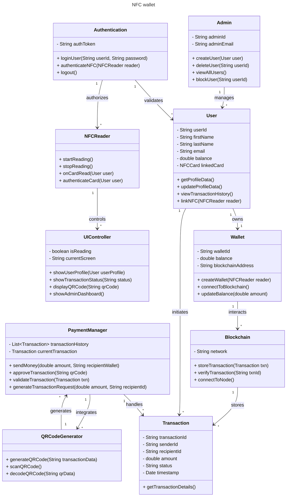

[](https://classroom.github.com/a/DIHvCS29)

##

# Video Link
- https://northeastern-my.sharepoint.com/:v:/r/personal/parkar_ar_northeastern_edu/Documents/Recordings/NextTAP%20Code%20Of%20DUty%20WEB%20DESIGN%20PROJECT-20241207_213457-Meeting%20Recording.mp4?csf=1&web=1&e=FmkcZy&nav=eyJyZWZlcnJhbEluZm8iOnsicmVmZXJyYWxBcHAiOiJTdHJlYW1XZWJBcHAiLCJyZWZlcnJhbFZpZXciOiJTaGFyZURpYWxvZy1MaW5rIiwicmVmZXJyYWxBcHBQbGF0Zm9ybSI6IldlYiIsInJlZmVycmFsTW9kZSI6InZpZXcifX0%3D


##

# 📱 Nextap

Nextap is an innovative wallet system that leverages NFC (Near Field Communication) and QR codes to simplify digital transactions, enabling users to create wallets, log in, and approve transactions seamlessly. By integrating blockchain technology, Nextap addresses common issues found in traditional wallet systems, offering a secure, user-friendly, and decentralized payment experience.

# 👥 Contributors

	•	Param Kamal – shah.paramk@northeastern.edu
	•	Arslan Parkar – parkar.ar@northeastern.edu
	•	Mayank Bhadrasen – bhadrasen.m@northeastern.edu
	•	Dany Sigha – nohonetsigha.d@northeastern.edu

# 🚀 Introduction

Nextap is designed to streamline digital payments by using NFC cards for wallet creation and login, and QR codes for transaction generation and approval. Unlike existing wallets that require app installations, hardware purchases, or custodial trust, Nextap offers a decentralized, low-cost solution by utilizing everyday NFC cards and QR codes.

# ❗ Problem Statement

The existing digital wallet solutions come with several limitations:
-	•	Custodial Wallets: Reliance on trusted entities, which can lead to security and privacy concerns.
-	•	Mobile Wallets: Require users to download and set up apps, which can be cumbersome.
-	•	Hardware Wallets: High cost and limited token support make them less accessible.

To overcome these challenges, we developed Nextap, allowing users to use their existing NFC-enabled credit/debit cards for wallet creation and login, while facilitating transactions through QR codes, without the need for additional apps or hardware.

# ✨ Key Features

-	•	NFC Card Wallet Creation: Use any NFC-enabled card to create and log in to your wallet effortlessly.
-	•	QR Code-Based Transactions: Generate and approve transactions using QR codes, reducing manual effort.
-	•	Blockchain Integration: Decentralized and secure storage of transaction data on the blockchain.
-	•	Offline Payment Support: Seamless offline payments using NFC cards, ideal for in-store and event purchases.
-	•	EIP-681 Support: Simplified transaction requests encoded into QR codes.

# 🛠️ Technology Stack

	•	Frontend:
	•	React.js (with Redux for state management)
	•	Tailwind CSS for modern and responsive styling
	•	Backend:
	•	Node.js & Express.js
	•	MongoDB for database management
	•	Cloud Services:
	•	Azure for cloud hosting and deployment
	•	Tableland (for decentralized data storage)
	•	Blockchain:
	•	Ethereum Smart Contracts
	•	NFC Integration: NFC Web API
	•	QR Code Generation: qrcode npm package
	•	Standards: EIP-681 (QR-based transaction requests)

# 🏗️ System Architecture

             +------------------+           +------------------+
             |  NFC Card User   |           |   QR Code User   |
             +------------------+           +------------------+
                      |                              |
                      |                              |
                NFC Web API                   QR Code Scanner
                      |                              |
                      +--------------+---------------+
                                     |
                         +-----------------------+
                         |      Nextap Backend   |
                         |  (Node.js & Express)  |
                         +-----------------------+
                                     |
                      +--------------+--------------+
                      |                             |
              +--------------+             +------------------+
              |  Blockchain  |             | MongoDB + Azure  |
              +--------------+             +------------------+


# Object model


# ⚙️ How It Works

1. NFC Card Wallet Creation

	•	Step 1: Tap your NFC-enabled card on your device.
	•	Step 2: The NFC Web API captures the card UID and creates a wallet address.
	•	Step 3: Wallet address is linked to the user on the blockchain.
	•	Step 4: The user can log in using the same NFC card.

2. QR Code Transaction Generation & Approval

	•	Step 1: The user initiates a payment, and a QR code is generated using EIP-681.
	•	Step 2: The QR code is stored in a decentralized Tableland database.
	•	Step 3: The recipient scans the QR code, retrieves transaction details, and approves the transaction.
	•	Step 4: Blockchain validates and completes the transaction.

# ✅ Advantages

-	•	No App Installation Required: Create wallets and conduct transactions using NFC cards and QR codes without installing any apps.
-	•	Increased Security: Decentralized storage and blockchain integration ensure high security and privacy.
-	•	Cost-Effective: No need for costly hardware wallets or custodial services.
-	•	User-Friendly: Simple and intuitive process for wallet creation, login, and transaction approval.
-	•	Offline Functionality: Supports offline payments, making it ideal for real-world retail and events.

# 📖 API Documentation

The Nextap application exposes several RESTful APIs to interact with the system, including NFC wallet creation, QR transaction generation, and user profile management. Below is a breakdown of the available APIs:


# 1. Profile API

Endpoint: /api/profile

-	•	GET /api/profile
-	•	Description: Fetch the current user’s profile details.
-	•	Response:
```bash
{
  "user_id": "12345",
  "wallet_address": "0xabc123def456",
  "transactions": [...],
  "nfc_card": "xxxx-xxxx-xxxx-xxxx"
}
```

-	•	POST /api/profile
-	•	Description: Update the user’s profile information.
-	•	Request Body:
```bash

{
  "name": "John Doe",
  "email": "johndoe@example.com",
  "phone": "+1234567890"
}
```

-	•	Response:
```bash
{
  "message": "Profile updated successfully."
}
```
# 2. NFC API

Endpoint: /api/nfc

-	•	POST /api/nfc/create_wallet
-	•	Description: Create a wallet using an NFC-enabled card.
-	•	Request Body:
```bash

{
  "nfc_card_id": "1234567890abcdef"
}
```

-	•	Response:
```bash

{
  "wallet_address": "0xabc123def456",
  "message": "Wallet created successfully."
}
```

-	•	POST /api/nfc/login
-	•	Description: Log in using an NFC card.
-	•	Request Body:
```bash

{
  "nfc_card_id": "1234567890abcdef"
}
```

-	•	Response:
```bash

{
  "message": "Logged in successfully.",
  "wallet_address": "0xabc123def456"
}
```
# 3. Tap Authentication API

Endpoint: /api/tap_auth

-	•	POST /api/tap_auth
-	•	Description: Authenticate the user via NFC tap.
-	•	Request Body:
```bash

{
  "nfc_card_id": "1234567890abcdef"
}
```

-	•	Response:
```bash

{
  "status": "success",
  "message": "Authentication successful."
}
```
4. QR Code Transaction API

Endpoint: /api/qr_transaction

-	•	POST /api/qr_transaction/generate
-	•	Description: Generate a QR code for a transaction.
-	•	Request Body:
```bash

{
  "transaction_amount": 100.00,
  "receiver_wallet": "0xdef456abc123"
}
```

-	•	Response:
```bash

{
  "qr_code_url": "https://example.com/qr/xyz123"
}
```

-	•	POST /api/qr_transaction/approve
-	•	Description: Approve a transaction via a scanned QR code.
-	•	Request Body:
```bash

{
  "transaction_id": "xyz123",
  "approval_status": "approved"
}
```

-	•	Response:
```bash
{
  "status": "success",
  "message": "Transaction approved."
}
```

# 📖 Usage Guide

Creating a Wallet

-	1.	Tap your NFC card on a compatible device.
-	2.	Follow the on-screen prompts to create your wallet.

Generating a QR Code for Payment

-	1.	Log in using your NFC card.
-	2.	Enter the transaction details.
-	3.	Generate a QR code and share it with the recipient.

Approving a Transaction

-	1.	Scan the QR code provided.
-	2.	Review the transaction details.
-	3.	Approve the transaction to complete it.

# 🚀 Future Enhancements

-	•	Mobile App Support: Develop a mobile app for extended compatibility.
-	•	Multi-Token Support: Add support for additional cryptocurrencies.
-	•	IoT Integration: Explore integration with IoT devices for automated payments.
-	•	Enhanced Security: Implement multi-factor authentication using biometrics.
-	•	Analytics Dashboard: Add a dashboard for users to track spending and transaction history.

# 🧑‍💻 Development Setup

Prerequisites

-	•	Node.js (v14 or higher)
-	•	MongoDB (for local database)
-	•	Azure Account (for cloud deployment)
-	•	Metamask Wallet (for interacting with blockchain)

Local Setup

1.	Clone the repository:
```bash

git clone https://github.com/username/nextap.git
cd nextap
```

2.	Install dependencies:
```bash

npm install
```

3.	Start the development server:

```bash

npm start
```
# 📝 License

This project is licensed under the MIT License - see the LICENSE file for details.


